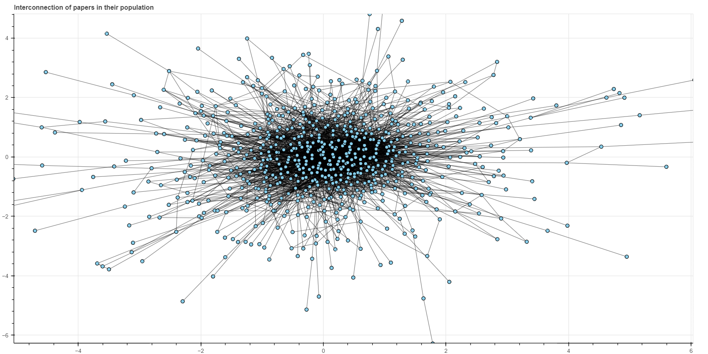

# Private working repository for SYSTER project

This python code reconstructs the graph of all related papers (indexed in scopus)for any given article. 

Fig. 1 The graph representing all the publications on the HC topic (the interactive version is [here](figures/)). A blue dot represents a publication and the black link is its connection with the other publication that cites it or where it is cited.

## Before getting started:

### Install the pybliometrics package extracting data from Scopus
Refer to the site for [pybliometrics instructions](https://pybliometrics.readthedocs.io/en/stable/)

### Get API keys for accessing Scopus via Elsevier API
1. To access Scopus via its API, you need two things. First, your institution needs to be a subscriber (not only to Scopus, but really to its API); second, you need to register API keys at https://dev.elsevier.com/apikey/manage. For each profile, you may register 10 keys.

2. Add you API keys into config.ini (see [instructions](https://pybliometrics.readthedocs.io/en/stable/configuration.html#))

### Other python packages 
Install other python packages, needed to run a code 
[networkx](https://networkx.org/documentation/stable/install.html) for working with netwrok graph
[bokeh.io](https://docs.bokeh.org/en/latest/docs/first_steps/installation.html) for creating the interactive graphs 

## Get Started:

## Files description:

